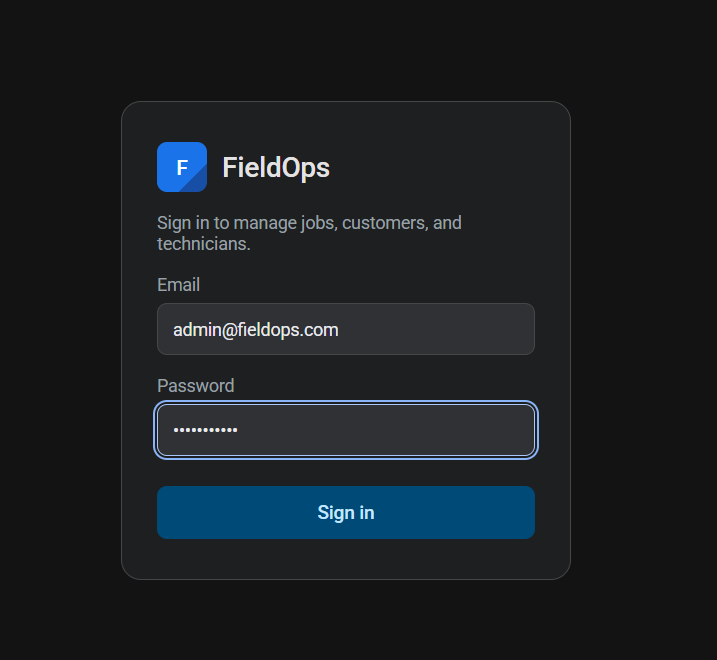
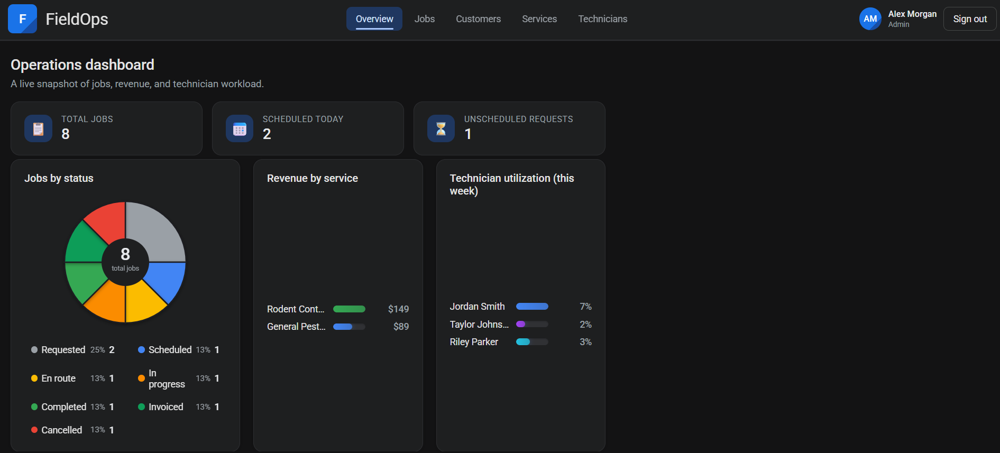
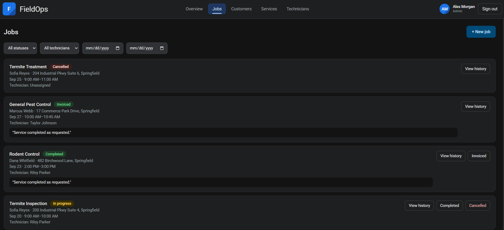
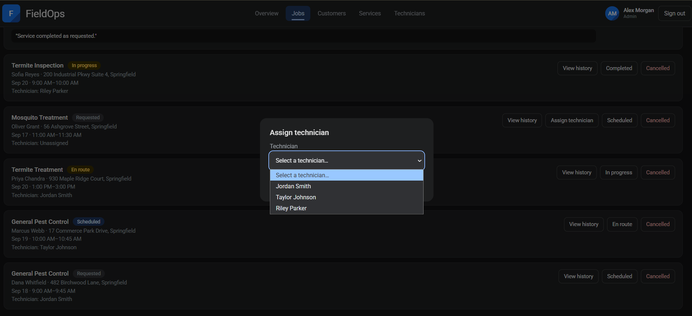
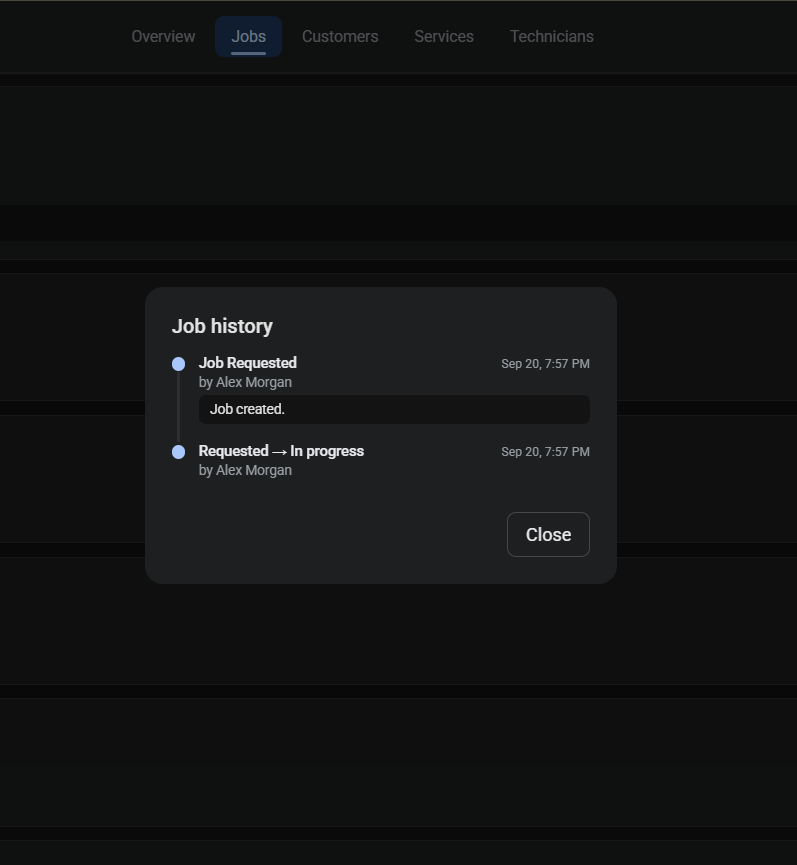
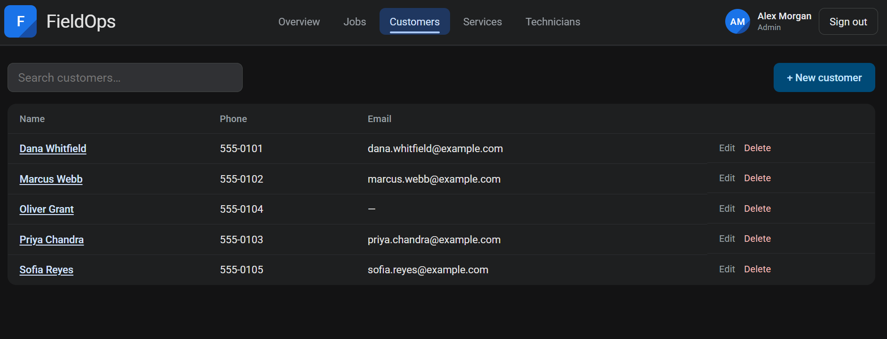
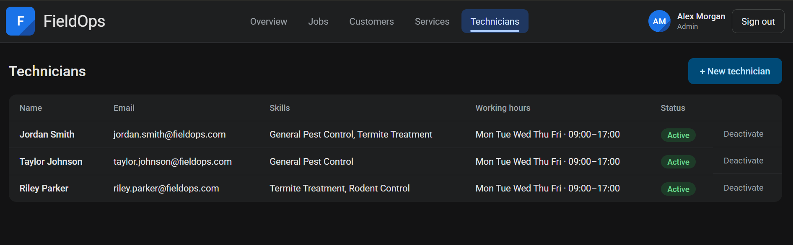
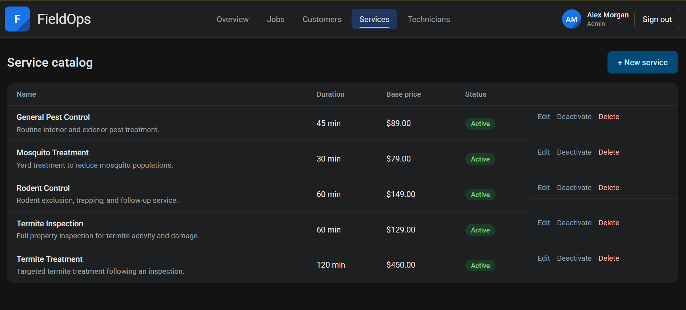
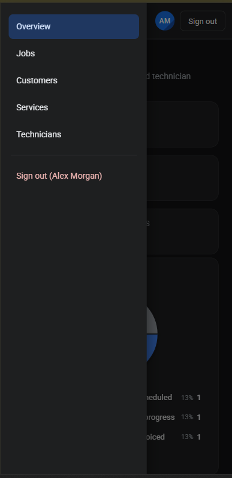

<div align="center">

# 🔧 FieldOps

### Field Service Dispatch & Operations Management

**Stop juggling spreadsheets and phone calls.** FieldOps gives pest-control, HVAC, and home-service businesses one real-time hub to manage customers, dispatch technicians, and track every job from first call to final invoice.

`React 19` · `Express 5` · `MongoDB` · `Bun`

</div>

---

## 🎯 What It Solves

Small field-service businesses lose money to double-booked technicians, missed follow-ups, and zero visibility into what's actually happening on the ground. **FieldOps fixes that** with a single source of truth for every customer, property, job, and technician — enforced by real business rules, not just a pretty form.

## ✨ Key Capabilities

| 🔐 **Role-Based Access** | Admins run the business; technicians see only their own work — enforced end to end, not just hidden in the UI. |
|---|---|
| 👥 **Customers & Properties** | One customer, many properties — full history in one click. |
| 🧾 **Service Catalog** | Configurable services with pricing and duration that drive every downstream calculation. |
| 🔁 **Job Lifecycle Engine** | A real state machine — `requested → scheduled → en route → in progress → completed → invoiced` — with illegal transitions blocked server-side. |
| 🛡️ **Conflict-Proof Scheduling** | Assigning a technician automatically checks for double-booking *and* working-hours violations before it's allowed. |
| 🔍 **Smart Filtering + Saved Views** | Filter by status, technician, or date — then save it as a one-click view, persisted per user in MongoDB. |
| 📊 **Live Operations Dashboard** | Revenue by service, technician utilization, and job-status breakdown — rendered as animated custom charts. |
| 🕒 **Full Audit Trail** | Every status change is logged with who, when, and why — visible right on the job. |

---

## 🛠 Technology Stack

| Layer | Choice |
|---|---|
| **Frontend** | React 19 + Vite |
| **Backend** | Node.js + Express 5 |
| **Database** | MongoDB (Mongoose ODM) |
| **Package Manager** | Bun — single workspace, single `bun.lock` |
| **Validation** | Zod on every write endpoint |
| **Auth** | JWT + bcrypt password hashing |
| **Styling** | Hand-crafted CSS with a design-token system — no UI framework |

---

## 📁 Project Structure

**Backend** (`backend/src/`)
- **`features/`** — one folder per domain capability
  - `auth/` — login, session, JWT issuance
  - `customers/` — customers + nested properties
  - `technicians/` — technician profiles & working hours
  - `service-catalog/` — service types, pricing, duration
  - `jobs/` — lifecycle, assignment, saved views, history
  - `dashboard/` — aggregated operations metrics
- **`shared/`**
  - `config/` — environment loading, MongoDB connection
  - `errors/` — centralized `AppError` class
  - `middleware/` — auth guard, role guard, rate limiting, error handler
- `scripts/seed.js` — deterministic database seeding
- `app.js` — Express app + route registration
- `index.js` — server entry point

**Frontend** (`frontend/src/`)
- **`features/`** — mirrors backend feature folders (`auth/`, `customers/`, `technicians/`, `service-catalog/`, `jobs/`, `dashboard/`)
- **`shared/`**
  - `api/client.js` — fetch wrapper, token storage
  - `components/`
- `App.jsx`, `styles.css`

**Root**
- `.vscode/launch.json` — debugger configuration
- `hackerrank.yml` — install/run commands, protected paths
- `setup.sh` — environment + MongoDB + seed bootstrap
- `README.md`

> Every backend feature follows the same request flow: **route → controller → service → repository → MongoDB** — keeping HTTP handling, business rules, and persistence cleanly separated.

---

## ✅ Prerequisites

- **Bun** ≥ 1.4 — [install guide](https://bun.sh)
- **MongoDB** running locally on `127.0.0.1:27017`
- **Git Bash** (Windows) or any POSIX shell — `setup.sh` uses Bash's `/dev/tcp` for MongoDB checks

---

## 🗄 MongoDB Behavior

- Every `install` and `start` verifies MongoDB is reachable on port `27017` before proceeding.
- Seeding **wipes all application collections** and rebuilds a consistent baseline — running it twice produces identical data.
- Every `bun start` re-runs the seed step, so the database always returns to its documented state.
- `GET /api/v1/health` reports live MongoDB connection status — distinguishing "API is up" from "database is actually connected."

---

## 🚀 Getting Started

**1. Clean install**
```bash
bun install && bash setup.sh --seed
```
Installs every workspace dependency, creates `.env` files from `.env.example` if missing, verifies MongoDB, and seeds the database.

**2. Run the app**
```bash
bun start
```
Launches the backend on **port 8000** and frontend on **port 3000**, concurrently — re-running setup/seed first.

> ⚠️ **Windows users:** run both commands from **Git Bash**, not PowerShell. The setup script's MongoDB check relies on a Bash-native feature that PowerShell's process model doesn't support correctly.

Then open **http://localhost:3000** 🎉

---

## 📜 Command Reference

| Command | What it does |
|---|---|
| `bun install` | Install all workspace dependencies |
| `bash setup.sh --seed` | Create env files, verify MongoDB, seed the database |
| `bun start` | Run the full app (backend + frontend, with setup/seed) |
| `bun run dev:backend` | Backend only, with auto-reload on file changes |
| `bun run dev:frontend` | Frontend only (Vite dev server) |
| `bun run seed` | Re-seed to baseline (run from `backend/`) |

---

## 🔑 Seeded Access

Every account below uses the password **`password123`**.

| Role | Email | Access |
|---|---|---|
| 🛡️ **Admin** | `admin@fieldops.com` | Full control — customers, technicians, services, jobs, dashboard |
| 🔧 **Technician** | `jordan.smith@fieldops.com` | Own assigned jobs only |
| 🔧 **Technician** | `taylor.johnson@fieldops.com` | Own assigned jobs only |
| 🔧 **Technician** | `riley.parker@fieldops.com` | Own assigned jobs only |

The interface adapts automatically to role — admins get the full operations suite, technicians get a focused view of their own work.

---

<div align="center">

*Built for the HackerRank "Build Your Own Full-Stack Application" assignment — mirroring the structure and conventions of the reference `coderepo-react-node-calendar` repository.*

</div>

---

## 📸 Screenshots

**Login**



**Admin Dashboard**



**Job List with Status Filtering**



**Technician Assignment**



**Job Audit Trail**



**Customer Management**



**Technician Management**



**Service Catalog**



**Mobile Navigation**


